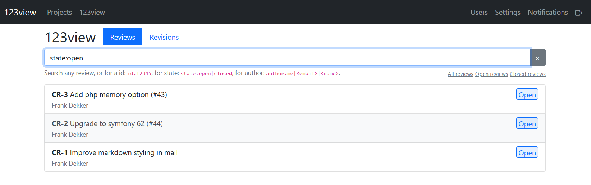
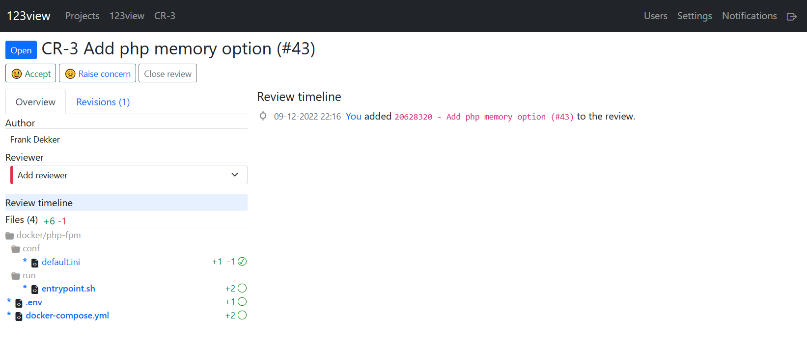

[](https://php.net/)
[](https://symfony.com/releases)
[](https://www.phpstan.com/)
[](https://app.codecov.io/gh/123inkt/123view)
[](https://github.com/123inkt/123view/actions)
[](https://github.com/123inkt/123view/actions)

# 123view - code review and commit notifications
A symfony application to create code reviews for a specific set of revisions not tied to a branch and to allow receiving commit notification for all commits in a certain time period.

### Features

**Code review:**
- Code reviews per repository.
- Join review, place comment or react to comment, accept and reject reviews.
- Attach and detach revisions to and from a review.
- Webhook to allow external projects be notified about review changes.

**Commit notification:**
- Receive one mail for all commits within a certain time period. Once per one, two, three, fours hours or daily or weekly.
- Exclude (or include) certain commit messages, files, or authors.
- Receive commits in a single mail for multiple repositories.
- Light or dark theme notification mail.
- Add links to your task or jira board based on the commit message.

**Examples:**
- Watch changes for `composer.json` for one or more repositories.
- Exclude all commits done by ci- or other automated processes.
- Exclude changes done to `composer.lock` for a repository.

## UI

<a href="docs/impressions.md">
    
</a>
<a href="docs/impressions.md">
    
</a>

## Requirements

- [docker >= 20.10](https://docs.docker.com/engine/install/)
- [docker compose plugin](https://docs.docker.com/compose/install/linux/)
- [git](https://git-scm.com/download/linux)

## Getting started

1) Clone repository: `git clone https://github.com/123inkt/123view.git 123view && cd 123view`
2) Start installer `bin/install.sh` to aid in filling the configuration options.
3) Start the application with `bin/start.sh`, and choose `prod`
4) Project should be available on: `https://<domain>/`.
5) The first user registered will receive admin permissions.

### Next
- [Adding repositories](docs/adding-repositories.md)
- [Add reviews](docs/indexing-repositories.md)
- [Configuration](docs/configuration.md)

## Development
```shell
git clone https://github.com/123inkt/123view.git 123view
cd 123view
./bin/start.sh
```
Choose `dev` and after all containers are started project should be available on https://<domain|localhost>.<br>
Accept the self-signed certificate in the browser.<br>
Review `.env.dev` and when needed and create a `.env.dev.local` with your own settings.

## About us

At 123inkt (Part of Digital Revolution B.V.), every day more than 30 developers are working on improving our internal ERP and our several shops. Do
you want to join us? [We are looking for developers](https://www.werkenbij123inkt.nl/vacatures).
