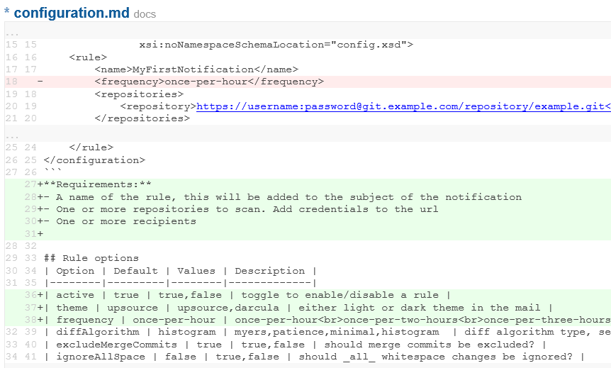
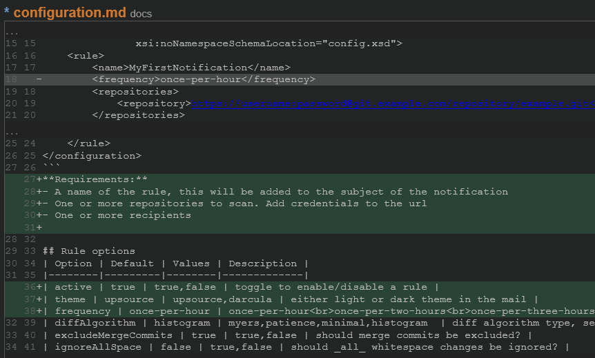
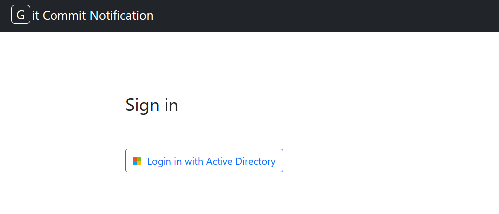
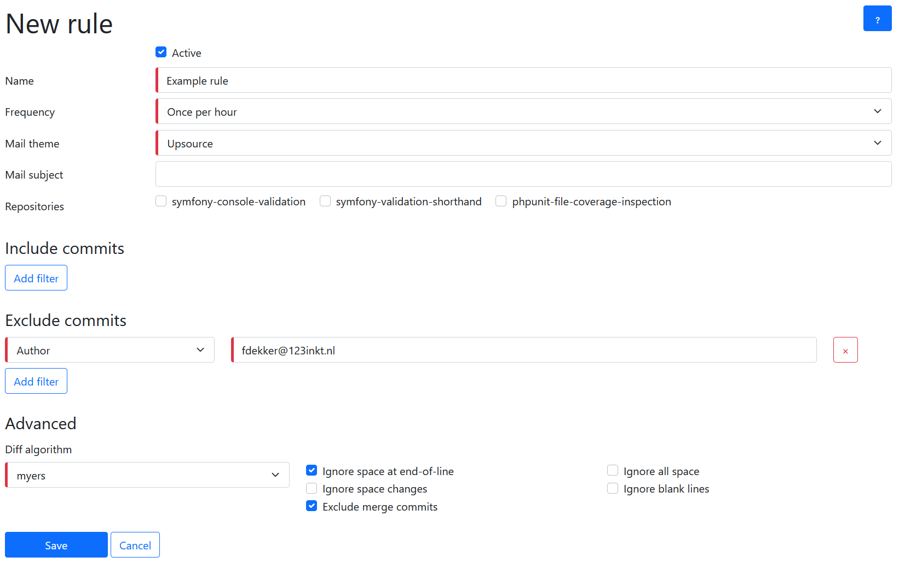

[](https://php.net/)
[](https://symfony.com/releases)
[](https://www.phpstan.com/)
[](https://php.net/)
[](https://github.com/123inkt/git-commit-notification/actions)
[](https://github.com/123inkt/git-commit-notification/actions)

# Git commit notification
A symfony application to allow receiving commit notification for all commits in a certain time period.

**Features:**
- Receive one mail for all commits within a certain time period. Once per one, two, three, fours hours or daily or weekly.
- Exclude (or include) certain commit messages, files, or authors.
- Receive commits in a single mail for multiple repositories.
- Light or dark theme notification mail.
- Add links to your task or jira board based on the commit message.

**Examples:**
- Watch changes for `composer.json` for one or more repositories.
- Exclude all commits done by ci- or other automated processes.
- Exclude changes done to `composer.lock` for a repository.

**Themes**




**UI**




## Requirements

- docker
- docker-compose

Or

- nginx
- php8.1+
- mysql
- git latest version

## Quick start

1) clone repository
```shell
git clone https://github.com/123inkt/git-commit-notification.git git-commit-notification
cd git-commit-notification
```
2) create `.env.dev.local` or `.env.prod.local`. See `.env` [configuration](docs/configuration.md) for how to configure the options.

3) Start
```shell
./bin/start.sh
```
4) choose `prod` or `dev` based on your environment. The project will be available on your host on:
   - dev: `https://<domain>:8443/`
   - prod: `https://<domain>/`

### Next
- [Adding repositories](docs/adding-repositories.md)
- [Adding external links](docs/adding-external-link.md)

## The crontab (prod):

When starting docker in production mode, the crontab will be configured. For manual setup, configure the crontab as below:

```shell
0 */1 * * * php bin/console mail --frequency=once-per-hour         > /dev/null 2>&1
0 */2 * * * php bin/console mail --frequency=once-per-two-hours    > /dev/null 2>&1
0 */3 * * * php bin/console mail --frequency=once-per-three-hours  > /dev/null 2>&1
0 */4 * * * php bin/console mail --frequency=once-per-four-hours   > /dev/null 2>&1
0 0 * * *   php bin/console mail --frequency=once-per-day          > /dev/null 2>&1
0 0 * * 1   php bin/console mail --frequency=once-per-week         > /dev/null 2>&1
```

See [command line options](docs/command-line.md) for more information about the console commands.

## Under the hood

1) Will fetch all commits for a given repository via the `git log` command.
2) Will bundle commits when author, branch and subject are identical.
3) For a set of commits, fetches the bundled changes between the first commit and the last
4) Send a notification mail in the desired formatting

## About us

At 123inkt (Part of Digital Revolution B.V.), every day more than 30 developers are working on improving our internal ERP and our several shops. Do
you want to join us? [We are looking for developers](https://www.werkenbij123inkt.nl/vacatures).
