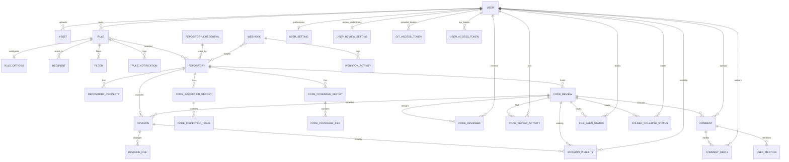

# Database model

This document summarizes the Doctrine ORM data model persisted by 123view. It covers mapped entities under `src\Entity\Asset`, `Config`, `Notification`, `Repository`, `Report`, `Review`, `Revision`, `User`, and `Webhook`, and excludes non-ORM value objects, enums, helpers, and factories.

Unless noted otherwise, primary keys are auto-increment integers and timestamps are stored as Unix epoch integers. Several columns use custom Doctrine types such as `uri_type`, `enum_*`, `line_coverage_type`, and `type_notification_status`; those are persisted database columns backed by application-specific PHP types.

## Relationship overview

The diagram shows the main relational structure. Standalone tables such as `external_link` are documented below but omitted from the graph for readability.

## Asset

### Asset
- **Represents:** Uploaded binary assets, currently image payloads stored directly in the database.
- **Table:** `asset`
- **Key columns:**
  - `id` — `integer` primary key.
  - `mime_type` — `string(255)` MIME type of the stored file.
  - `data` — `binary` blob containing the asset bytes.
  - `create_timestamp` — `integer` creation time.
  - `user_id` — nullable foreign key to the uploading `user`.
- **Relationships:** `ManyToOne` to `User` via `user_id`.
- **Indexes / constraints:** Primary key only; no additional indexes or uniques beyond the foreign key.

## Config

### ExternalLink
- **Represents:** Configured pattern-to-URL mappings for turning external references into links.
- **Table:** `external_link`
- **Key columns:**
  - `id` — `integer` primary key.
  - `pattern` — `string(255)` pattern matched against external references.
  - `url` — `string(255)` URL template to open.
- **Relationships:** None.
- **Indexes / constraints:** Primary key only.

## Notification

### Rule
- **Represents:** A user-owned notification rule that selects repositories and drives commit notification delivery.
- **Table:** `rule`
- **Key columns:**
  - `id` — `integer` primary key.
  - `user_id` — foreign key to the owning `user`.
  - `active` — `boolean` enabled flag.
  - `name` — `string(255)` rule name.
- **Relationships:**
  - `ManyToOne` to `User`.
  - `ManyToMany` to `Repository` through join table `rule_repository`.
  - `OneToOne` to `RuleOptions`.
  - `OneToMany` to `Recipient`, `Filter`, and `RuleNotification`.
- **Indexes / constraints:** Foreign-key index on `user_id`; join table `rule_repository` uses composite primary key (`rule_id`, `repository_id`) plus indexes on both foreign keys.

### RuleOptions
- **Represents:** Per-rule delivery and diff-rendering settings.
- **Table:** `rule_options`
- **Key columns:**
  - `id` — `integer` primary key.
  - `rule_id` — unique foreign key to `rule`.
  - `frequency` — `enum_frequency` scheduling cadence.
  - `send_type` — `enum_notification_send` (`mail`, `browser`, or `both`).
  - `diff_algorithm` — `enum_diff_algorithm`.
  - `ignore_space_at_eol`, `ignore_space_change`, `ignore_all_space`, `ignore_blank_lines`, `exclude_merge_commits` — `boolean` diff/filter flags.
  - `subject` — nullable `string(255)` custom subject line.
  - `theme` — `enum_mail_theme`.
- **Relationships:** Owning side of a `OneToOne` with `Rule`.
- **Indexes / constraints:** Unique index on `rule_id` enforces one options row per rule.

### Recipient
- **Represents:** A named email recipient attached to a notification rule.
- **Table:** `recipient`
- **Key columns:**
  - `id` — `integer` primary key.
  - `rule_id` — foreign key to `rule`.
  - `email` — `string(255)` recipient email address.
  - `name` — nullable `string(255)` display name.
- **Relationships:** `ManyToOne` to `Rule`.
- **Indexes / constraints:** Unique constraint `rule_email` on (`rule_id`, `email`) prevents duplicate recipients per rule.

### Filter
- **Represents:** Include/exclude filters used by a rule to match authors or file patterns.
- **Table:** `filter`
- **Key columns:**
  - `id` — `integer` primary key.
  - `rule_id` — foreign key to `rule`.
  - `type` — `enum_filter_type` filter category.
  - `inclusion` — `boolean` include vs. exclude behavior.
  - `pattern` — `string(255)` match pattern.
- **Relationships:** `ManyToOne` to `Rule`.
- **Indexes / constraints:** Primary key plus foreign-key index on `rule_id`.

### RuleNotification
- **Represents:** Persisted history of notifications produced by a rule.
- **Table:** `rule_notification`
- **Key columns:**
  - `id` — `integer` primary key.
  - `rule_id` — foreign key to `rule`.
  - `read` — `boolean` read flag for the stored notification record.
  - `notify_timestamp` — `integer` when the notification applies.
  - `create_timestamp` — `integer` when the record was created.
- **Relationships:** `ManyToOne` to `Rule`.
- **Indexes / constraints:** Index `IDX_RULE_ID` on `rule_id`.

## Repository

### Repository
- **Represents:** A source-code repository known to 123view, including sync settings and optional remote credentials.
- **Table:** `repository`
- **Key columns:**
  - `id` — `integer` primary key.
  - `name` — `string(255)` internal repository key; unique.
  - `display_name` — `string(255)` human-facing label.
  - `main_branch_name` — `string(255)` default branch, default `master`.
  - `url` — `uri_type` remote repository URL.
  - `credential_id` — nullable foreign key to `repository_credential`.
  - `git_type` — nullable `enum_git_type` provider integration type.
  - `active`, `favorite`, `git_approval_sync` — `boolean` operational flags.
  - `update_revisions_interval`, `update_revisions_timestamp`, `validate_revisions_interval`, `validate_revisions_timestamp` — integer sync scheduling fields.
  - `create_timestamp` — nullable `integer`.
- **Relationships:**
  - `ManyToOne` to `RepositoryCredential`.
  - `OneToMany` to `RepositoryProperty`, `Revision`, and `CodeReview`.
  - Participates in `ManyToMany` links from `Rule` and `Webhook`.
- **Indexes / constraints:** Unique index on `name`; index `active_idx` on `active`; foreign-key index on `credential_id`.

### RepositoryProperty
- **Represents:** Repository-scoped key/value configuration entries.
- **Table:** `repository_property`
- **Key columns:**
  - `repository_id` — foreign key to `repository`.
  - `name` — `string(255)` property key.
  - `value` — `string(255)` property value.
- **Relationships:** `ManyToOne` to `Repository`.
- **Indexes / constraints:** Composite primary key (`repository_id`, `name`).

### RepositoryCredential
- **Represents:** Reusable credential material for accessing external repositories.
- **Table:** `repository_credential`
- **Key columns:**
  - `id` — `integer` primary key.
  - `name` — `string(255)` label.
  - `auth_type` — `enum_authentication_type`; currently basic auth.
  - `value` — `string(255)` serialized credential payload.
- **Relationships:** Referenced by `Repository`.
- **Indexes / constraints:** Primary key only.

## Report

### CodeInspectionReport
- **Represents:** A static-analysis or code-inspection run captured for a specific repository commit.
- **Table:** `code_inspection_report`
- **Key columns:**
  - `id` — `integer` primary key.
  - `repository_id` — foreign key to `repository`.
  - `commit_hash` — `string(255)` inspected commit.
  - `inspection_id` — `string(50)` inspection tool/run identifier.
  - `branch_id` — nullable `string(255)` branch context.
  - `create_timestamp` — `integer` report time.
- **Relationships:** `ManyToOne` to `Repository`; `OneToMany` to `CodeInspectionIssue`.
- **Indexes / constraints:** Unique constraint `IDX_COMMIT_HASH_REPOSITORY_ID` on (`repository_id`, `inspection_id`, `commit_hash`); indexes on `create_timestamp` and (`repository_id`, `create_timestamp`).

### CodeInspectionIssue
- **Represents:** An individual inspection finding belonging to a code inspection report.
- **Table:** `code_inspection_issue`
- **Key columns:**
  - `id` — `integer` primary key.
  - `report_id` — foreign key to `code_inspection_report`.
  - `severity` — `string(50)` severity level.
  - `file` — `string(255)` affected file path.
  - `line_number` — `integer` affected line.
  - `message` — `string(255)` issue text.
  - `rule` — nullable `string(255)` tool rule identifier.
- **Relationships:** `ManyToOne` to `CodeInspectionReport`.
- **Indexes / constraints:** Index `file_report_idx` on (`report_id`, `file`).

### CodeCoverageReport
- **Represents:** A coverage snapshot for a repository commit.
- **Table:** `code_coverage_report`
- **Key columns:**
  - `id` — `integer` primary key.
  - `repository_id` — foreign key to `repository`.
  - `commit_hash` — `string(255)` covered commit.
  - `branch_id` — nullable `string(255)` branch context.
  - `create_timestamp` — `integer` report time.
- **Relationships:** `ManyToOne` to `Repository`; `OneToMany` to `CodeCoverageFile`.
- **Indexes / constraints:** Indexes on `create_timestamp`, (`repository_id`, `create_timestamp`), and (`repository_id`, `commit_hash`).

### CodeCoverageFile
- **Represents:** Per-file coverage data inside a coverage report.
- **Table:** `code_coverage_file`
- **Key columns:**
  - `id` — `integer` primary key.
  - `report_id` — foreign key to `code_coverage_report`.
  - `file` — `string(255)` file path.
  - `percentage` — nullable `decimal(5,2)` summary percentage.
  - `coverage` — `line_coverage_type` serialized line-by-line coverage payload.
- **Relationships:** `ManyToOne` to `CodeCoverageReport`.
- **Indexes / constraints:** Index `report_filepath` on (`report_id`, `file`).

## Review

### CodeReview
- **Represents:** The main review aggregate for a commit set or branch review.
- **Table:** `code_review`
- **Key columns:**
  - `id` — `integer` primary key.
  - `repository_id` — foreign key to `repository`.
  - `project_id` — `integer` per-repository review sequence key.
  - `reference_id` — nullable `string(255)` external/provider review identifier.
  - `title`, `description` — `string(255)` review metadata.
  - `type` — `enum_code_review_type` (`commits` or `branch`).
  - `target_branch` — nullable `string(255)` for branch reviews.
  - `state` — `enum_code_review_state_type`.
  - `ext_reference_id` — nullable `string(255)` external reference.
  - `ai_review_requested` — `boolean`.
  - `actors` — `json` actor ids, default `[]`.
  - `create_timestamp`, `update_timestamp` — `integer` lifecycle timestamps.
- **Relationships:** `ManyToOne` to `Repository`; `OneToMany` to `Revision`, `CodeReviewer`, and `Comment`.
- **Indexes / constraints:** Unique constraints on (`reference_id`, `repository_id`) and (`project_id`, `repository_id`); indexes on `title`, (`repository_id`, `title`), (`repository_id`, `state`), (`create_timestamp`, `repository_id`), and (`update_timestamp`, `repository_id`).

### CodeReviewer
- **Represents:** Assignment of a user as reviewer on a code review.
- **Table:** `code_reviewer`
- **Key columns:**
  - `id` — `integer` primary key.
  - `review_id` — foreign key to `code_review`.
  - `user_id` — foreign key to `user`.
  - `state` — `enum_code_reviewer_state_type`.
  - `state_timestamp` — `integer` when the reviewer state last changed.
- **Relationships:** `ManyToOne` to `CodeReview` and `User`.
- **Indexes / constraints:** Foreign-key indexes on `review_id` and `user_id`.

### CodeReviewActivity
- **Represents:** Audit/event log rows attached to a review.
- **Table:** `code_review_activity`
- **Key columns:**
  - `id` — `integer` primary key.
  - `review_id` — foreign key to `code_review`.
  - `user_id` — nullable foreign key to `user`.
  - `event_name` — `string(255)` activity type.
  - `data` — nullable `json` event payload.
  - `create_timestamp` — `integer` event time.
- **Relationships:** `ManyToOne` to `CodeReview`; optional `ManyToOne` to `User`.
- **Indexes / constraints:** Composite index `IDX_CREATE_TIMESTAMP_USER_EVENT` on (`create_timestamp`, `user_id`, `event_name`); additional indexes on `review_id`, `event_name`, and `user_id`.

### Comment
- **Represents:** A top-level review thread anchored to a file/line reference.
- **Table:** `comment`
- **Key columns:**
  - `id` — `integer` primary key.
  - `review_id` — foreign key to `code_review`.
  - `user_id` — foreign key to `user`.
  - `file_path` — `string(500)` reviewed file.
  - `line_reference` — `string(2000)` serialized diff line reference.
  - `state` — `string(20)` open/resolved state.
  - `ext_reference_id` — nullable `string(255)` provider-side comment id.
  - `message` — `text` comment body.
  - `tag` — nullable `enum_comment_tag_type`.
  - `notification_status` — nullable `type_notification_status` notification bitmask.
  - `create_timestamp`, `update_timestamp` — `integer` timestamps.
- **Relationships:** `ManyToOne` to `CodeReview` and `User`; `OneToMany` to `CommentReply` and `UserMention`.
- **Indexes / constraints:** Index `IDX_REVIEW_ID_FILE_PATH` on (`review_id`, `file_path`); foreign-key indexes on `review_id` and `user_id`.

### CommentReply
- **Represents:** A reply inside a review comment thread.
- **Table:** `comment_reply`
- **Key columns:**
  - `id` — `integer` primary key.
  - `comment_id` — foreign key to `comment`.
  - `user_id` — foreign key to `user`.
  - `message` — `text` reply body.
  - `tag` — nullable `enum_comment_tag_type`.
  - `ext_reference_id` — nullable `string(255)` provider-side reply id.
  - `notification_status` — nullable `type_notification_status`.
  - `create_timestamp`, `update_timestamp` — `integer` timestamps.
- **Relationships:** `ManyToOne` to `Comment` and `User`.
- **Indexes / constraints:** Foreign-key indexes on `comment_id` and `user_id`.

### UserMention
- **Represents:** Normalized `@mention` rows captured from a top-level comment.
- **Table:** `user_mention`
- **Key columns:**
  - `comment_id` — foreign key to `comment`.
  - `user_id` — `integer` mentioned user id stored as a scalar value.
- **Relationships:** `ManyToOne` to `Comment`.
- **Indexes / constraints:** Composite primary key (`comment_id`, `user_id`); index on `comment_id`. Note that `user_id` is not modeled as an ORM relation to `User`.

### FileSeenStatus
- **Represents:** Per-user tracking of which review files have been viewed.
- **Table:** `file_seen_status`
- **Key columns:**
  - `id` — `integer` primary key.
  - `review_id` — foreign key to `code_review`.
  - `user_id` — foreign key to `user`.
  - `file_path` — `string(500)` reviewed file path.
  - `create_timestamp` — `integer` when the file was marked seen.
- **Relationships:** `ManyToOne` to `CodeReview` and `User`.
- **Indexes / constraints:** Unique constraint `IDX_REVIEW_USER_FILEPATH` on (`review_id`, `user_id`, `file_path`).

### FolderCollapseStatus
- **Represents:** Per-user UI state for collapsed folders in a review tree.
- **Table:** `folder_collapse_status`
- **Key columns:**
  - `id` — `integer` primary key.
  - `review_id` — foreign key to `code_review`.
  - `user_id` — foreign key to `user`.
  - `path` — `string(500)` collapsed folder path.
- **Relationships:** `ManyToOne` to `CodeReview` and `User`.
- **Indexes / constraints:** Unique constraint `IDX_REVIEW_USER_PATH` on (`review_id`, `user_id`, `path`).

## Revision

### Revision
- **Represents:** A persisted git revision/commit snapshot, optionally attached to a review.
- **Table:** `revision`
- **Key columns:**
  - `id` — `integer` primary key.
  - `repository_id` — foreign key to `repository`.
  - `review_id` — nullable foreign key to `code_review`.
  - `commit_hash` — `string(50)` commit sha.
  - `parent_hash` — nullable `string(50)` parent sha.
  - `title`, `description` — `string(255)` commit metadata.
  - `first_branch` — nullable `string(255)` first branch the revision was seen on.
  - `author_email`, `author_name` — `string(255)` author metadata.
  - `create_timestamp` — `integer` commit/create timestamp.
  - `sort` — nullable `binary(16)` sortable revision key.
- **Relationships:** `ManyToOne` to `Repository`; optional `ManyToOne` to `CodeReview`; `OneToMany` to `RevisionFile`.
- **Indexes / constraints:** Unique constraint `repository_commit_hash` on (`repository_id`, `commit_hash`); indexes on `create_timestamp`, (`first_branch`, `repository_id`), (`repository_id`, `parent_hash`), and (`sort`, `create_timestamp`).

### RevisionFile
- **Represents:** File-level change statistics for a revision.
- **Table:** `revision_file`
- **Key columns:**
  - `id` — `integer` primary key.
  - `revision_id` — foreign key to `revision`.
  - `filepath` — `string(500)` changed file path.
  - `lines_added` — `integer`.
  - `lines_removed` — `integer`.
- **Relationships:** `ManyToOne` to `Revision`.
- **Indexes / constraints:** Foreign-key index on `revision_id`.

### RevisionVisibility
- **Represents:** Per-user visibility state for a revision within a specific review.
- **Table:** `revision_visibility`
- **Key columns:**
  - `revision_id` — foreign key to `revision`.
  - `review_id` — foreign key to `code_review`.
  - `user_id` — foreign key to `user`.
  - `visible` — `boolean` visibility flag.
- **Relationships:** `ManyToOne` to `Revision`, `CodeReview`, and `User`.
- **Indexes / constraints:** Composite primary key (`revision_id`, `review_id`, `user_id`); index `review_user_idx` on (`review_id`, `user_id`).

## User

### User
- **Represents:** Core authenticated application user.
- **Table:** `user`
- **Key columns:**
  - `id` — `integer` primary key.
  - `name` — `string(255)` display name.
  - `email` — `string(255)` login identifier; unique.
  - `password` — nullable `string(255)` hashed password.
  - `roles` — `space_separated_string_type` serialized role list.
  - `gitlab_user_id` — nullable `integer` external provider user id.
- **Relationships:** `OneToOne` to `UserSetting` and `UserReviewSetting`; `OneToMany` to `Rule`, `GitAccessToken`, `CodeReviewer`, `Comment`, and `CommentReply`.
- **Indexes / constraints:** Unique constraint `EMAIL` on `email`.

### UserSetting
- **Represents:** General user preferences for theme, notifications, and IDE integration.
- **Table:** `user_setting`
- **Key columns:**
  - `id` — `integer` primary key.
  - `user_id` — nullable unique foreign key to `user`.
  - `color_theme` — `enum_color_theme`.
  - `mail_comment_added`, `mail_comment_resolved`, `mail_comment_replied` — `boolean` mail-notification preferences.
  - `browser_notification_events` — `string(10000)` serialized browser notification event list.
  - `ide_url` — nullable `string(500)` IDE deep-link template.
- **Relationships:** Owning side of a `OneToOne` to `User`.
- **Indexes / constraints:** Unique index on `user_id` allows at most one settings row per user.

### UserReviewSetting
- **Represents:** Per-user code review display preferences.
- **Table:** `user_review_setting`
- **Key columns:**
  - `id` — `integer` primary key.
  - `user_id` — unique foreign key to `user`.
  - `diff_visible_lines` — `integer` collapsed-context setting.
  - `diff_comparison_policy` — `string(50)` diff comparison mode.
  - `review_diff_mode` — `string(50)` inline vs. split mode.
  - `review_comment_visibility` — `string(50)` comment filter mode.
- **Relationships:** Owning side of a required `OneToOne` to `User`.
- **Indexes / constraints:** Unique index on `user_id`.

### GitAccessToken
- **Represents:** External provider access token per user and git provider.
- **Table:** `git_access_token`
- **Key columns:**
  - `id` — `integer` primary key.
  - `user_id` — foreign key to `user`.
  - `git_type` — `enum_git_type` provider discriminator.
  - `token` — `string(1000)` provider token.
- **Relationships:** `ManyToOne` to `User`.
- **Indexes / constraints:** Unique constraint `user_tokens` on (`user_id`, `git_type`) enforces one token per provider per user.

### UserAccessToken
- **Represents:** Application/API token used for authenticating requests as a user.
- **Table:** `user_access_token`
- **Key columns:**
  - `id` — `integer` primary key.
  - `user_id` — foreign key to `user`.
  - `token` — fixed-width `char(80)` token value; unique.
  - `name` — `string(100)` label.
  - `usages` — `integer` usage counter.
  - `create_timestamp` — `integer` creation time.
  - `use_timestamp` — nullable `integer` last-use time.
- **Relationships:** `ManyToOne` to `User`.
- **Indexes / constraints:** Unique constraint `IDX_TOKEN` on `token`; index `IDX_USER_ID` on `user_id`.

## Webhook

### Webhook
- **Represents:** Configured outgoing webhook endpoint tied to one or more repositories.
- **Table:** `webhook`
- **Key columns:**
  - `id` — `integer` primary key.
  - `enabled` — `boolean` activation flag.
  - `url` — `string(255)` target endpoint.
  - `retries` — `integer` retry count.
  - `verify_ssl` — `boolean` TLS verification flag.
  - `headers` — nullable `json` custom request headers.
- **Relationships:** `ManyToMany` to `Repository` through `webhook_repository`; `OneToMany` to `WebhookActivity`.
- **Indexes / constraints:** Join table `webhook_repository` uses composite primary key (`webhook_id`, `repository_id`) plus foreign-key indexes on both columns.

### WebhookActivity
- **Represents:** Delivery log for a webhook invocation attempt.
- **Table:** `webhook_activity`
- **Key columns:**
  - `id` — `integer` primary key.
  - `webhook_id` — nullable foreign key to `webhook`.
  - `request` — `text` request body snapshot.
  - `request_headers` — nullable `json`.
  - `status_code` — `integer` HTTP response code.
  - `response` — `text` response body snapshot.
  - `response_headers` — nullable `json`.
  - `create_timestamp` — `integer` attempt time.
- **Relationships:** `ManyToOne` to `Webhook`.
- **Indexes / constraints:** Index `create_timestamp_idx` on `create_timestamp`; foreign-key index on `webhook_id`.
