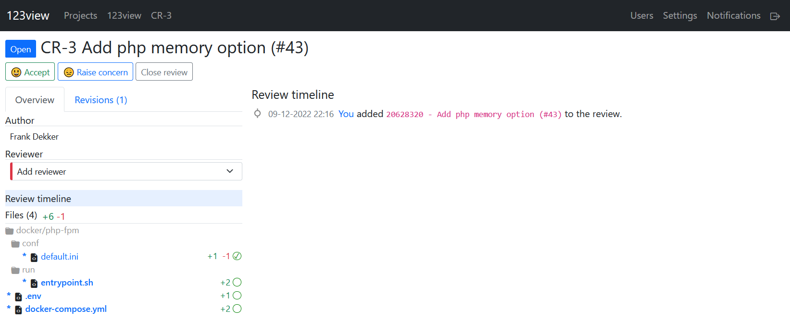
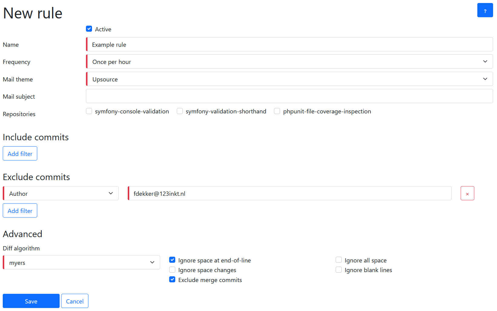

## Impressions

### 123view imported as project:
Able to search and filter on reviews

### The review page, with timeline of activities

### View changes with language aware code highlighting and unified diff

### Dark mode available as theme under settings

### Add comments to a specific line in a file with markdown support

### Reply and resolve comments. Users will receive mail notification of these events

### Add more revisions to a review

### Select the revisions you want to add

### Customize the theme and comment notifications

### Watch for commits in certain repositories with files included or excluded

### Receive mail notification

